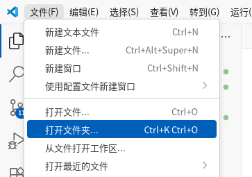
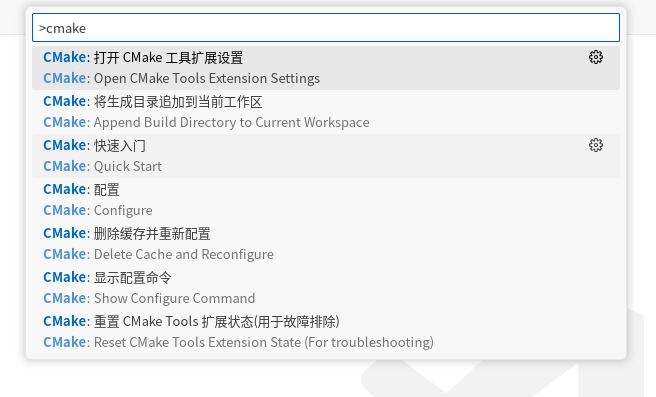
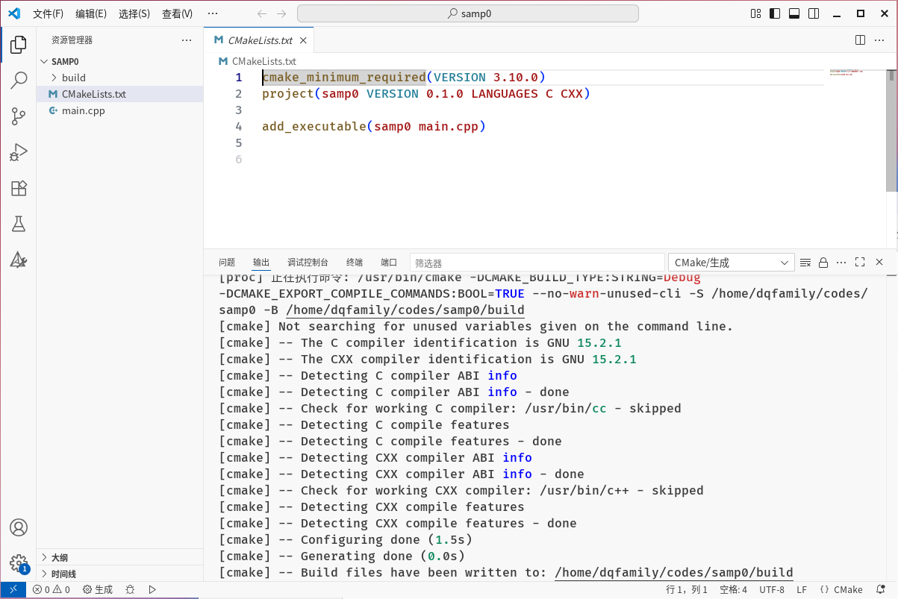
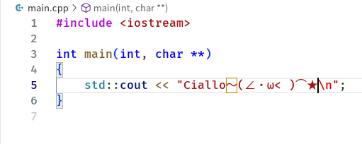
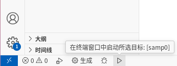

# 第一个C++程序

> 本站点遵守[CC BY-NC-SA 4.0 许可](https://creativecommons.org/licenses/by-nc-sa/4.0/deed.zh-hans)，请勿忽视这些条款。
>

## 配置环境

| 项目                                                                                                   | 作用                                                          |
| ------------------------------------------------------------------------------------------------------ | ------------------------------------------------------------- |
| [CMake构建系统](https://cmake.org/download/)                                                           | 管理大型项目的复杂构建步骤                                    |
| [Ninja](https://github.com/ninja-build/ninja/releases)                                                 | 辅助构建                                                      |
| [MinGW_W64](https://github.com/niXman/mingw-builds-binaries/releases)                                  | 包含gcc编译器、链接器等                                       |
| [CMake Tools（Vscode插件）](https://marketplace.visualstudio.com/items?itemName=ms-vscode.cmake-tools) | 为本地开发者在 Visual Studio Code 中基于 CMake 的项目提供帮助 |

> 机房已配置好这些环境。

---

## 从零创建C++源文件

使用vscode打开一个全新的空文件夹：



按`Ctrl+Shift+P`打开命令面板，输入`cmake`，并点击`CMake：快速入门`：



要求输入项目名称，填文件夹名即可（或者一个应景的只含英文字母与符号的名字）。

之后选择`创建C++项目 > 创建可执行文件 > 确定`，出现这个页面就算创建成功了：



打开main.cpp,写一些你想写的东西（爱写啥写啥）：



按Ctrl+S保存（或者设置自动保存）。

然后点击左下角的三角形图表开始自动构建&运行：



终端输出：

```bash
❯ /home/dqfamily/codes/samp0/build/samp0
Ciallo～(∠・ω< )⌒★
```

恭喜🎉