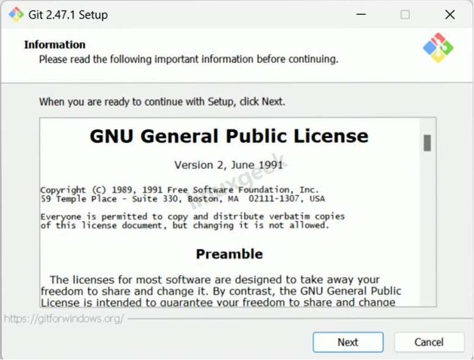
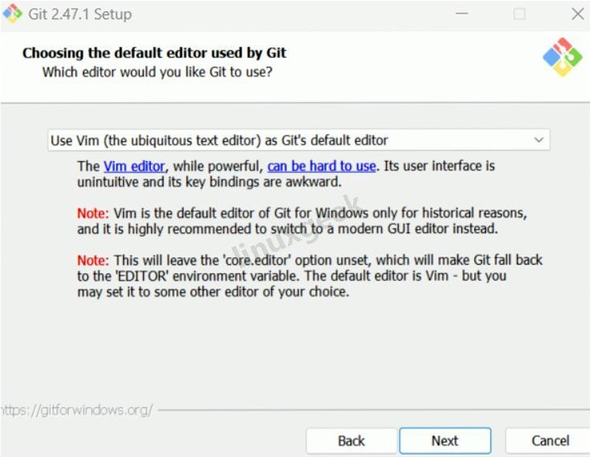
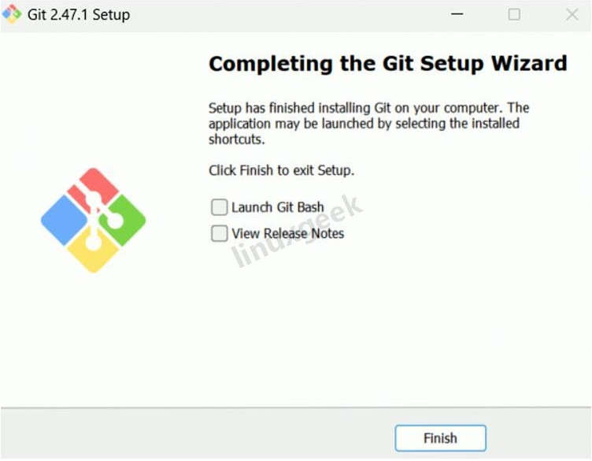

# 版本控制

> 本站点遵守[CC BY-NC-SA 4.0 许可](https://creativecommons.org/licenses/by-nc-sa/4.0/deed.zh-hans)，请勿忽视这些条款。

使用Git进行版本控制是个好主意——它允许用户间多人协作，允许用户轻松地将项目回退到历史版本，包含一些必不可少的重要功能。

本教程旨在帮助大家认识如何使用Git以及[GitHub](https://github.com/)。

## 安装Git
> Git现已不支持Windows 7, 不过好在我们的新系统映像已安装了Git.

进入[Git下载页](https://git-scm.com/downloads),选择适合系统架构的Git安装。

在资源管理器左侧页面找到“下载”，双击刚刚下载的.exe可执行文件：

[](https://www.cnblogs.com/linuxgeek/articles/18928378)

一路点击`Next`,直到出现如下页面：

[](https://www.cnblogs.com/linuxgeek/articles/18928378)

在下拉列表里选择`Use Visual Studio Code as Git's default editor`。

来到下一个页面：

[](https://www.cnblogs.com/linuxgeek/articles/18928378)

这里选第二个选项（推荐）。

然后只要狂点Next就行，这些选项保持默认就可以了。

[](https://www.cnblogs.com/linuxgeek/articles/18928378)

大功告成！


---

## 配置Git

Git的初始化配置非常简单。

在桌面（或者任意文件夹）右键，点击`Open Git Bash here`（或者打开终端，在标题栏下拉列表中选中`Git Bash`）：

[](https://blog.csdn.net/m0_53692627/article/details/135119406)

然后执行下面两行命令：

``` bash
git config --global user.name "Your Name"
```

``` bash
git config --global user.email "your.email@example.com"
```
> ⚠️注意：
>  
> 引号内要改为GitHub用户名和注册GitHub时使用的邮箱地址！

---

## 使用Git


