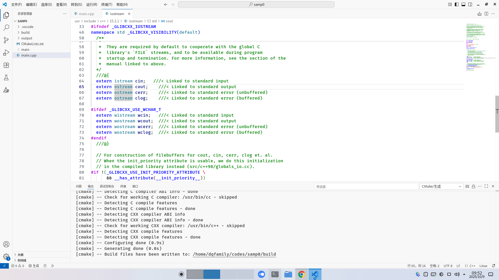

# 简单C++源文件一般格式

> 本站点遵守[CC BY-NC-SA 4.0 许可](https://creativecommons.org/licenses/by-nc-sa/4.0/deed.zh-hans)，请勿忽视这些条款。

现在让我们了解一个C++源文件的基本格式。

回顾在上一章我们编写的代码：

```cpp
#include <iostream>

int main(int, char **)
{
    std::cout << "Ciallo～(∠・ω< )⌒★\n";
}

```

这个简单的源文件包含以下两部分：

```cpp
#include <iostream>
```
这是一句要求编译器导入iostream标准库的编译指令。有了这一句指令，编译器就知道了cout的定义。

鼠标对准`cout`，按住Ctrl并单击鼠标，可以看到vscode把我们带到了iostream库源文件：



我们能使用`cout`的原因是：`#include <iostream>`编译指令在预编译阶段被iostream文件的内容取代，组合成一个复合文件。

之后编译器将编译这个复合文件，生成可执行程序。

来看余下的代码：

```cpp
int main(int, char **)
{
    std::cout << "Ciallo～(∠・ω< )⌒★\n";
}
```

这是主函数`main`的定义。C++函数的写法并不复杂，大致都形如以下语句：

```cpp
返回值类型 函数名(参数){
    // 函数体
    ...;
    return 返回值;
}
```
> ⚠️注意：
>
> 主函数一般不需要编写`return`语句。

* **返回值类型**：定义函数返回的结果类型，常用的有：int整型、float/double浮点型、bool布尔型等（甚至可以是自定义的class类型）。
* **函数名**：提供一个名称便于外界调用。
* **参数**：将外界数据作为变量/或常量传递至函数内部，供函数使用。填void与让它空着等效，表示函数不接受任何参数。
* **return语句**：把函数执行的结果告诉调用此函数的语句。

> 还没写完...